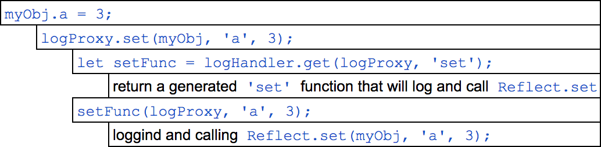

#### ES6 Features

# Use cases for Proxy

> This is archived content from our blog "DealWithJS" which doesn't exist anymore.

#### Table of Contents

- [Basic example of using a Proxy](#basic-example-of-using-a-proxy)
- [Default values](#default-values)
- [Hiding private properties](#hiding-private-properties)
- [A better enum](#a-better-enum)
- [OnChange event for objects and arrays](#onchange-event-for-objects-and-arrays)
- [Cache with property specific TTL](#cache-with-property-specific-ttl)
- [Using the "in" operator like "includes"](#using-the-"in"-operator-like-"includes")
- [Singleton pattern](#singleton-pattern)
- [Validation and revocable access](#validation-and-revocable-access)
- [Cookie object](#cookie-object)
- [Python-like array slicing](#python-like-array-slicing)
- [Proxy as a proxy handler](#proxy-as-a-proxy-handler)
- [Performance measurements](#performance-measurements)

### Preface

By now, you have probably heard about, or even used [ES6 Proxy](https://developer.mozilla.org/en-US/docs/Web/JavaScript/Reference/Global_Objects/Proxy). There is a lot of information around about what Proxy is, and how to use it, but I found surprisingly little on what to use it for. So I tried to find some real(ish) use cases.

Proxy is supported in all modern browsers. (Hint: Internet Explorer is not a modern browser.)

This post is pretty code-heavy, so I didn't put the full sources here as usual, but you find the link for the relevant source at the beginning of every section. Also, you can open [`index.html`](https://gergob.github.io/jsProxy) to browse and try out all of them.

Some examples are throwing errors. I know that every developer says the same, but don't worry, this is intentional. You will see that the lines where I expect an error are in try-catch blocks and marked with comments too.

Before we dive in, here's a little refresher on the syntax and usage.

### Basic example of using a Proxy

Source code: [00-basic-example.js](../00-basic-example.js)

Proxy is a way to wrap an object to intercept its basic operations, like getting a property value. We can provide a handler object with [traps](https://developer.mozilla.org/en-US/docs/Web/JavaScript/Reference/Global_Objects/Proxy/#Methods_of_the_handler_object) for the operations we want to intercept. The operations we don't define a trap for will be forwarded to the original object.

When we asking for `proxy.a` in our example, our `handler.get` trap will be called. It can do whatever it wants before/after forwarding the call to the original object. Of course, it doesn't have to forward the call, it can do something else entirely.

Users of the Proxy don't have direct access to the original object, which makes it a good tool for encapsulation, validation, access control, and a whole bunch of other things. Keep on reading to see some interesting examples.

Let's see what we can use this for...

### Default values

Source code: [01-prop-defaults.js](../01-prop-defaults.js)

The first real example is adding default values to an object. When we ask for a missing key, we will get the corresponding value from the `defaults` object we provided. Note that the `in` operator still sees what keys are or aren't there. We could define a trap for that too, you will see that later, but in this example, this is the correct behavior because this way client code can differentiate between real and default values.

You probably noticed the `Reflect.get` call. We can use the `Reflect` module to call the original function that would have ran if we haven't proxied the object. We could use `obj[prop]` too, like in the previous example, but this is cleaner, and it uses the same implementation a non-proxied object would use. This maybe doesn't sound important in a simple trap like `get`, when we can easily replicate the original behavior, but some other traps like `ownKeys` would be more difficult and error-prone to replicate, so it's best to get into the habit of using `Reflect` in my opinion.

### Hiding private properties

Source code: [02-private-properties.js](../02-private-properties.js)

Proxy is also good for limiting access to properties, in this case, hiding properties starting with an underscore, making them really private.

As you see there are five different traps we need to define to achieve this, but all of them follow the same logic. We ask the provided `filterFunc` if we should forward the call, or pretend that the property isn't there.

By the way, you can see the advantages of using `Reflect` better now. It would have required a lot more code to implement the proper forwarding in all these traps.

### A better enum

Source code: [03-enum-basic.js](../03-enum-basic.js)

A lot of JavaScript code is using strings, plain, or frozen objects as enums. As you probably know, these solutions have their type safety problems and are generally error-prone.

Proxy can offer a viable alternative. We take a plain key-value object and making it more robust by protecting it from (even inadvertent) modifications. Even harder than `Object.freeze` would. (Which disallows modification, but doesn't throw an error, which can lead to silent bugs.)

In the source, there are three sections, showing how a plain object, a frozen object, and our enum Proxy handles the same mistakes we could make in client code.

We could even take it a step further and use the Proxy to augment our enum with some "simulated" methods. (These methods aren't really there, but with the Proxy, we live-bind them.) For example, we could add a method for getting back the name of the enum from its value.

Source code: [03-enum-nameof.js](../03-enum-nameof.js)

We could use plain prototype inheritance for adding methods in the usual way, but the name of the methods would appear when we get the keys of the enum with `Object.keys` for example. Also, I wanted to show that we can do this.

### OnChange event for objects and arrays

Source code: [04-onchange-object.js](../04-onchange-object.js)

Proxy is also good for subscribing to events happening with objects. In our example, we forward everything to the original object, but after setting or deleting a property, we also call the `onChange` event handler.

By the same method, we could implement other events too. For example an `onValidate` event for validating changes before applying them.

This pattern can be useful for arrays as well. And besides item changes, it also tracks property changes, like `length`.

### Cache with property specific TTL

Source code: [05-proxy-as-handler.js](../05-cache.js)

With Proxy, we can control the value that we store in our object too. This is useful if we need to store some metadata with our values. In this example, we put a TTL (time to live) beside the real value, so when we set a property `cache.a = 42`, instead of `42`, we store `{ttl: 30, value: 42}`. (Of course, we need to do the opposite when getting a property.) Then we decrease the `ttl` every second and when it reaches zero, remove the property.

Also, we get the TTL from a function that can return different values for different property names, so for example, we could cache config values for a minute, but ajax responses for only ten seconds.

Of course, this can also be achieved by storing the TTLs in a separate object, but I think this is a more elegant solution. And I wanted to show this "inline metadata" capability because it can come in handy in many situations. One thing coming to mind is an object that interfaces some database, using the metadata to store management data, like when was the data saved, or has it been modified since.

### Using the "in" operator like "includes"

Source code: [06-array-in.js](../06-array-in.js)

We can also use Proxy to do some limited [operator overloading](https://en.wikipedia.org/wiki/Operator_overloading). Limited, because we can't overload any operator, only `in`, `of`, `delete`, and `new`. We will overload `new` in the next example.

But in this one, we just hijack the `in` operator to use it like [`Array.includes`](https://developer.mozilla.org/en/docs/Web/JavaScript/Reference/Global_Objects/Array/includes), that is, to check if a value is in the array.

Ok, this probably isn't very useful in real projects, but I think it's kind of cool.

### Singleton pattern

Source code: [07-singleton-pattern.js](../07-singleton-pattern.js)

We can implement the singleton pattern (and other [creational patterns](https://en.wikipedia.org/wiki/Creational_pattern)) with Proxy. In this example, we use the `construct` trap to modify the behavior of the `new` operator to return the singleton instance every time.

Using singletons in JavaScript is a controversial matter. Many developers think that it's an obsolete design pattern since we use Dependency Injection. Regardless, it's a nice and easy pattern to show how we can trap object construction with Proxy. And you can use the same method for factories, builders, etc.

### Validation and revocable access

Source code: [08-revocable-validated.js](../08-revocable-validated.js)

We can use Proxy to validate properties and property values before adding them to the object. Let's imagine we are making a library, that wants to get some options from the client code, so we fire off an event handler and passing it the empty options object (or one pre-filled with defaults), and the client code can set the options. But we want to accept only valid options and values, otherwise, we throw an error.

We could do the validation after we got back the object, but baking the validation into the object itself has some advantages. Our library code can safely assume the object is always valid, so we don't need validation and error handling code everywhere we use it.

By using a revocable proxy, we can even revoke the client code's access, so it can't modify it after the event handler returns. In more general terms, when we pass internal objects to external code for modification, we can protect it against later tampering.

### Cookie object

Source code: [09-cookie-object.js](../09-cookie-object.js)

In this example, we augment an object with cookie persistence. When we create the object, we load the cookies to properties, and from then on, we save every change to the cookies too.

Instead of cookies, we could use a real database too, but those usually have async APIs (as they should), and that leaves us no choice but to return [promises](https://developer.mozilla.org/en/docs/Web/JavaScript/Reference/Global_Objects/Promise) instead of values, and that would make the client code weird. Instead of `console.log(dbObject.x, dbObject.y)` we would have to write `Promise.all([dbObject.x, dbObject.y]).then(console.log)` so our Proxy wouldn't make it any simpler, than using the original database API. But I will definitely do some more thinking in this area. Because an API like this would be very cool.

### Python-like array slicing

Source code: [10-python-slicing.js](../10-python-slicing.js)

Those of you familiar with Python are probably love the [list slicing](https://docs.python.org/2.3/whatsnew/section-slices.html) syntax, and like myself would love to have something similar in JavaScript.

For those of you who aren't familiar, Python allows you to:

1. Take a subset of a list (array) by using the `list[start:end:step]` syntax. So, for example, you can get every 3rd item from index 10 to 20 by `list[10:20:3]`. (Note: `end` is exclusive, so it's only going through items 10-19.)
2. You can use negative indices if you need to index from the end of the list. So `-1` is the last item, `-2` is the second to last, etc.

Of course, you can do the same in JavaScript, but not in this concise and elegant way. But as you probably guessed by now, we can use Proxy.

JavaScript syntax doesn't allow us to put colons in the array index, but it's perfectly fine if we use a string. So we can write the previous example like `list["10:20:3"]`, and in the `get` trap, we can forward the call if the index is a number, but do the slicing and return the results if the index is a string.

There's nothing special in this example, most of the code is just the splitting logic. The Proxy handler itself is about 3 lines of code, with only a `get` trap.

### Proxy as a proxy handler

Source code: [11-proxy-as-handler.js](../11-proxy-as-handler.js)

This last one is admittedly not that useful, but it's a fun little pattern I didn't want to exclude, so I've added it as a bonus 11th example.

Here, we use a Proxy object (`logProxy`) to act as the handler for another Proxy (`myObj`), generating all the traps dynamically. So when we do `myObj.a = 3`, normally, the handler's `set` trap would fire. But since the handler (`logProxy`) is a Proxy itself, its handler's `get` trap will fire, trying to get the `set` trap like this: `logHandler.get(logProxy, 'set')`. In there, we generate and return the relevant trap, made dynamically by putting logs before and after the `Reflect[trap]` call. This might be confusing at first read so here is an illustration of the calls happening:

I can only think of one use for it: if you want to make a Proxy with all of the traps looking the same (ie: the same code before and after the Reflect call), so you can generate them instead of writing a bunch of boilerplate code.

As you will see, this double proxying is especially slow (which is not that surprising), so I don't recommend it in production code at all.

### Performance measurements

Source code: [performance.js](../performance.js)

I made this little performance measurement and ran it in 3 current browsers (on a 2015 MacBook Pro).

The results:

<table style="border: 1px solid #efefef">
  <thead>
    <tr>
      <th>Object / Proxy type</th>
      <th>Chrome (ms)</th>
      <th>Safari (ms)</th>
      <th>Firefox (ms)</th>
    </tr>
  </thead>
  <tbody>
    <tr>
      <td>Normal object</td>
      <td>623</td>
      <td>764</td>
      <td>1.510</td>
    </tr>
    <tr>
      <td>No-op forwarding proxy</td>
      <td>1.506</td>
      <td>1.770</td>
      <td>1.950</td>
    </tr>
    <tr>
      <td>Proxy using Reflect</td>
      <td>3.335</td>
      <td>4.531</td>
      <td>8.435</td>
    </tr>
    <tr>
      <td>Proxy as dynamic handler</td>
      <td>5.626</td>
      <td>6.005</td>
      <td>10.947</td>
    </tr>
  </tbody>
</table>

There is a significant difference between the browsers, but in general, the more abstract proxying patterns are a lot slower. In my opinion, unreasonably slower. I could understand some performance hit for the abstraction, but 5-8x slower for a Proxy with Reflect is way too much. But this will probably improve over time, as the implementations will mature.

Interesting, that Firefox supports this feature for the longest time (since May 2015), and it was the slowest in my test.

### Conclusion

My opinion is that Proxy is a useful tool in our arsenal. It can be used for a wide range of problems and has the potential to make code simpler and more readable. But we should keep in mind that if we change the way objects behave at such a low level, we won't just confuse other parts of the code, but probably our fellow developers too. We should document these objects (and patterns) properly, maybe separate them to their own file, or even come up with some naming convention to make it crystal clear that these objects are special.

Regarding performance, it is usable in production code, but not for objects under extreme usage. An options object (like in example 08) would only receive a few calls at a time, so in that case, the performance hit is negligible. In contrast, I wouldn't put a Proxy on an Angular `$scope`, a Redux `Store`, or similar heavily used object. At least not in production code. Might be an interesting experiment though... ;)

---

If you enjoyed reading this blog post, please share it or like the [Facebook page](https://www.facebook.com/dealwithjs) of the website to get regular updates. You can also follow us [@dealwithjs](https://twitter.com/dealwithjs).

Happy proxying!

.

## Csaba Hellinger

Full-stack web dev

March 7, 2017
